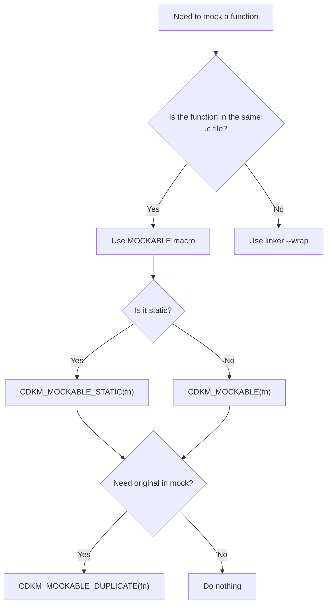

# C Development Kit: Mock

## Introduction

The **C Development Kit (CDK)** is a collection of lightweight, MIT-licensed libraries to make C development on Linux simpler and more consistent.

**CDK: Mock** is the mocking component. It provides a minimal, portable way to **mock any function in your C project**, so you can write meaningful tests without rewriting or overcomplicating code. Works with both **GCC** and **Clang**.

---

## Quick Start

### Example: Marking a function as mockable

Create file `main.c`:
```c
#include <stdio.h>
#include "cdk_mock.h"

/* Production function, marked as mockable */
CDKM_MOCKABLE(int add(int a, int b)) {
    return a + b;   // default implementation
}

/* Expose original symbol for mocks to call */
CDKM_MOCKABLE_DUPLICATE(add);

int main(void) {
    printf("add(2,3) = %d\n", add(2, 3));
    return 0;
}
```

and file `mock.c`:
```
/* Mock only enabled when CDK_MOCK_ENABLE is defined */
#ifdef CDK_MOCK_ENABLE
#include "stdio.h"

int __real_add(int a, int b);
int add(int a, int b) {
  printf("Mocked add called!\n");
  return __real_add(a, b) + 100;
}
#endif
```

### Run without mocks (production build)

```sh
gcc main.c mock.c -o demo
./demo
# Output: add(2,3) = 5
```

### Run with mocks (test build)

```sh
gcc -DCDK_MOCK_ENABLE main.c mock.c -o demo_test
./demo_test
# Output:
# Mocked add called!
# add(2,3) = 105
```

### Example: Mocking functions without macro

CDK Mock can also use the linker’s `--wrap` feature to mock functions **without any macros**.
This works with **CMake**, **Meson**, and plain GCC builds.

See the [`examples/cmake/`](examples/cmake), [`examples/meson/`](examples/meson), and [`examples/gcc/`](examples/gcc) directories.

To build and run:
```sh
cd examples/cmake
./compile.sh
./build/example_1       # run original
./build/example_1_test  # run with mocks
```

Mocks are written in separate `.c` files using the special `__wrap_<fn>` / `__real_<fn>` pattern:
```c
// mock_lib.c
#include <stdio.h>

int __real_bar(void);              // original implementation
int __wrap_foo(void) { return 999; }  // replace calls to foo()

int bar(void) {
    puts("Mocked bar called");
    return __real_bar();           // delegate to original
}
```

This way you can **intercept any function at link time** without touching its original source.

### More examples

Full working examples are in the `examples/` directory, with **CMake**, **Meson**, and plain compiler builds.

---

## API usage decision tree

Here is a diagram showing when to use `MOCKABLE_*` macros vs. `--wrap`:



---

## How It Works

CDK Mock is built on two well-established compiler features:

1. **Linker wrapping (`--wrap`)**
   Replace any function call with a wrapper, while still having access to the real function:

   ```c
   void *__real_malloc(size_t);
   void *__wrap_malloc(size_t size) {
       printf("malloc called with %zu\n", size);
       return __real_malloc(size);
   }
   ```

   Compile with:

   ```sh
   clang main.c -Wl,--wrap=malloc -o wrapdemo
   ```

2. **Weak symbols**
   Mark a function as `__attribute__((weak))` to let a mock override it at link time:

   ```c
   __attribute__((weak))
   int my_func(void) { return 42; }

   int my_func(void) { return -1; } // mock replaces weak symbol
   ```

CDK Mock wraps these techniques in a **clean API** so you don’t need to deal with compiler/linker quirks directly.

---

## FAQ

**What is CDK: Mock?**
A tiny C library that makes mocking functions simple and consistent.

**Why use it?**
Because hand-rolled mocks are repetitive and error-prone. CDK Mock abstracts the boilerplate and works across toolchains.

**License?**
MIT — free for both open-source and commercial projects.

**Who is it for?**

* Developers writing unit tests in plain C
* Embedded/Linux engineers needing lightweight testing utilities
* Teams that want mocks without dragging in heavy frameworks
